# Mesh Formats

## MFEM mesh v1.0

This is the default format in GLVis. It can be used to describe simple (triangular, quadrilateral, tetrahedral and hexahedral meshes with straight edges) or complicated (curvilinear and more general) meshes.

### Straight meshes

In the simple case of a mesh with straight edges the format looks as follows
```sh
MFEM mesh v1.0

# Space dimension: 2 or 3
dimension
<dimension>

# Mesh elements, e.g. tetrahedrons (4)
elements
<number of elements>
<element attribute> <geometry type> <vertex index 1> ... <vertex index m>
...

# Mesh faces/edges on the boundary, e.g. triangles (2)
boundary
<number of boundary elements>
<boundary element attribute> <geometry type> <vertex index 1> ... <vertex index m>
...

# Vertex coordinates
vertices
<number of vertices>
<vdim>
<coordinate 1> ... <coordinate <vdim>>
...
```

Lines starting with "#" denote comments. The supported geometry types are:

  - POINT       = 0
  - SEGMENT     = 1
  - TRIANGLE    = 2
  - SQUARE      = 3
  - TETRAHEDRON = 4
  - CUBE        = 5
  - PRISM       = 6

see the comments in [this source file](https://github.com/mfem/mfem/blob/master/fem/geom.hpp) for more details.

For example, the [beam-quad.mesh](https://github.com/mfem/mfem/blob/master/data/beam-quad.mesh) file from the data directory looks like this:
```sh
MFEM mesh v1.0

dimension
2

elements
8
1 3 0 1 10 9
1 3 1 2 11 10
1 3 2 3 12 11
1 3 3 4 13 12
2 3 4 5 14 13
2 3 5 6 15 14
2 3 6 7 16 15
2 3 7 8 17 16

boundary
18
3 1 1 0
3 1 2 1
3 1 3 2
3 1 4 3
3 1 5 4
3 1 6 5
3 1 7 6
3 1 8 7
3 1 9 10
3 1 10 11
3 1 11 12
3 1 12 13
3 1 13 14
3 1 14 15
3 1 15 16
3 1 16 17
1 1 0 9
2 1 17 8

vertices
18
2
0 0
1 0
2 0
3 0
4 0
5 0
6 0
7 0
8 0
0 1
1 1
2 1
3 1
4 1
5 1
6 1
7 1
8 1
```
which corresponds to the mesh

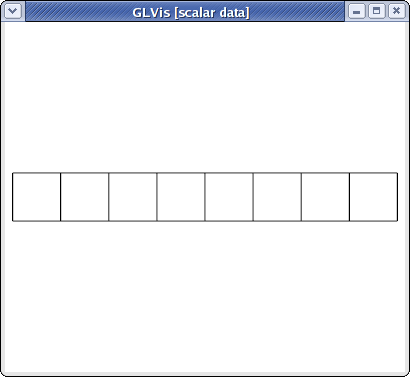

visualized with
```sh
glvis -m beam-quad.mesh -k "Ame****"
```

### Curvilinear and more general meshes

The MFEM mesh v1.0 format also support the general description of meshes based on a vector finite element grid function with degrees of freedom in the "nodes" of the mesh. This general format is described briefly below, and in more details on the [General Mesh Format page](mesh-format-v1.x.md).

```sh
MFEM mesh v1.0

# Space dimension: 2 or 3
dimension
<dimension>

# Mesh elements, e.g. tetrahedrons (4)
elements
<number of elements>
<element attribute> <geometry type> <vertex index 1> ... <vertex index m>
...

# Mesh faces/edges on the boundary, e.g. triangles (2)
boundary
<number of boundary elements>
<boundary element attribute> <geometry type> <vertex index 1> ... <vertex index m>
...

# Number of vertices (no coordinates)
vertices
<number of vertices>

# Mesh nodes as degrees of freedom of a finite element grid function
nodes
FiniteElementSpace
FiniteElementCollection: <finite element collection>
VDim: <dimension>
Ordering: 0
<x-coordinate degrees of freedom>
...
<y-coordinate degrees of freedom>
...
<z-coordinate degrees of freedom>
...
```
Some possible [finite element collection](https://github.com/mfem/mfem/blob/master/fem/fe_coll.hpp) choices are: `Linear`, `Quadratic` and `Cubic` corresponding to curvilinear P1/Q1, P2/Q2 and P3/Q3 meshes. The algorithm for the numbering of the degrees of freedom can be found in [MFEM's source code](https://github.com/mfem/mfem/blob/master/fem/fespace.cpp#L739).

For example, the [escher-p3.mesh](https://github.com/mfem/mfem/blob/master/data/escher-p3.mesh) from MFEM's [data directory](https://github.com/mfem/mfem/blob/master/data) describes a tetrahedral mesh with nodes given by a P3 vector Lagrangian finite element function. Visualizing this mesh with
```sh
glvis -m escher-p3.mesh -k "Aaaoooooooooo**************tt"
```
we get:

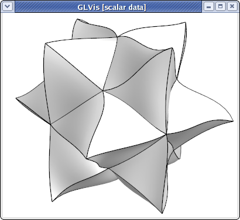

Topologically periodic meshes can also be described in this format, see for example the [periodic-segment](https://github.com/mfem/mfem/blob/master/data/periodic-segment.mesh), [periodic-square](https://github.com/mfem/mfem/blob/master/data/periodic-square.mesh), and [periodic-cube](https://github.com/mfem/mfem/blob/master/data/periodic-cube.mesh) meshes in the data directory, as well as [Example 9](examples.md?advection).


## MFEM NC mesh v1.0

The `MFEM NC mesh v1.0` is a format for nonconfoming meshes in MFEM. It is
similar in style to the default (conforming) `MFEM mesh v1.0` format, but is
in fact independent and supports advanced AMR features such as

* storing refined elements and the refinement hierarchy,
* anisotropic element refinement,
* hanging nodes (vertices),
* parallel partitioning.

The file starts with a signature and the mesh dimension:
```sh
MFEM NC mesh v1.0

# NCMesh supported geometry types:
# SEGMENT     = 1
# TRIANGLE    = 2
# SQUARE      = 3
# TETRAHEDRON = 4
# CUBE        = 5
# PRISM       = 6

# mesh dimension 1, 2 or 3
dimension
<dimension>

# optional rank for parallel files, defaults to 0
rank
<MPI rank>
```
The `rank` section defines the MPI rank of the process that saved the file.
This section can be omitted in serial meshes.

Similarly to the conforming format, the next section lists all elements. This
time however, we recognize two kinds of elements:

* Regular, active elements (`refinement type == 0`). These elements participate
  in the computation (are listed in the `Mesh` class) and reference vertex indices.
* Inactive, previously refined elements (`refinement type > 0`). Instead of
  vertices, these elements contain links to their child elements, and are not
  visible in the `Mesh` class.

All elements also have their geometry type and user attribute defined, as well
as the MPI rank of their owner process (only used in parallel meshes).

```sh
# mesh elements, both regular and refined
elements
<number of elements>
<owner rank> <attribute> <geometry type> 0 <vertex indices>
<owner rank> <attribute> <geometry type> <refinement type> <child indices>
...
```

Storing the complete refinement hierarchy allows MFEM to coarsen some of the
fine elements if necessary, and also to naturally define an ordering of the
fine elements that can be used for fast parallel partitioning of the mesh (a
depth-first traversal of all refinement trees defines a space-filling curve
(SFC) that can be easily partitioned among parallel processes).

The following picture illustrates the refinement hierarchy of a mesh that
started as two quadrilaterals and then underwent two anisotropic refinements
(blue numbers are vertex indices):
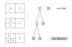

The corresponding `elements` section of the mesh file could look like this:

```sh
elements
6
0 1 3 2 2 3      # element 0: refinement 2 (Y), children 2, 3
0 1 3 0 1 2 5 4  # element 1: no refinement, vertices 1, 2, 5, 4
0 1 3 1 4 5      # element 2: refinement 1 (X), children 4, 5
0 1 3 0 6 7 4 3  # element 3: no refinement, vertices 6, 7, 4, 3
0 1 3 0 0 8 9 6  # element 4: no refinement, vertices 0, 8, 9, 6
0 1 3 0 8 1 7 9  # element 5: no refinement, vertices 8, 1, 7, 9
```

The refinement types are numbered as follows:


Note that the type is encoded as a 3-bit number, where bits 0, 1, 2 correspond
to the X, Y, Z axes, respectively. Other element geometries allow fewer
but similar refinement types: triangle (3), square (1, 2, 3), tetrahedron (7),
prism (3, 4, 7).

The next section is the `boundary` section, which is exactly the same as in the
conforming format:

```sh
boundary
<number of boundary elements>
<boundary element attribute> <geometry type> <vertex indices>
...
```

The nonconfoming mesh however needs to identify hanging vertices, which may
occur in the middle of edges or faces as elements are refined. A hanging vertex
always has two "parent" vertices.

```sh
vertex_parents
<number of records>
<vertex number> <parent 1 number> <parent 2 number>
...
```

In our example above, vertices 6, 7, 8, 9 are hanging vertices, so the
`vertex_parents` section would look like this:

```sh
vertex_parents
4
6 0 3
7 1 4
8 0 1
9 6 7
```

The hanging vertices can appear in any order in this section. The only
limitation is that the first N vertex indices (not listed in this section) be
reserved for the top-level vertices (those with no parents, typically the
vertices of the coarse mesh).

The next section is optional and can be safely omitted when creating the mesh
file manually. The `root_state` section affects leaf ordering when traversing
the refinement trees and is used to optimize the SFC-based partitioning. There
is one number per root element. The default state for all root elements is zero.

```sh
root_state
<number of records>
<root element state>
...
```

Finally, we have the `coordinates` section which assigns physical positions
to the N top-level vertices. Note that the positions of hanging vertices are
always derived from their parent vertices and are not listed in the mesh file.

```sh
coordinates
<number of top-level vertices>
<vdim>
<coordinate 1> ... <coordinate <vdim>>
...
```

If the mesh is curvilinear, the `coordinates` section can be replaced with
an alternative section called `nodes`. The `nodes` keyword is then followed
by a serialized `GridFunction` representing a vector-valued finite element
function defining the curvature of the elements, similarly as in the conforming
case.

For examples of meshes using the `NC mesh v1.0` format, see
[amr-quad.mesh](https://github.com/mfem/mfem/blob/master/data/amr-quad.mesh),
[amr-hex.mesh](https://github.com/mfem/mfem/blob/master/data/amr-hex.mesh) and
[fichera-amr.mesh](https://github.com/mfem/mfem/blob/master/data/fichera-amr.mesh)
(visualized below) in the `data` directory of MFEM.

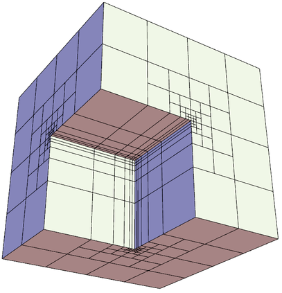


## NURBS meshes

MFEM provides full support for meshes and discretization spaces based on Non-uniform Rational B-Splines (NURBS). These are treated similarly to general [curvilinear meshes](#curvilinear-and-more-general-meshes) where the NURBS nodes are specified as a grid function at the end of the mesh file.

For example, here is a simple quadratic NURBS mesh for a square domain with a (perfectly) circular hole in the middle. (The exact representation of conical sections is a major advantage of the NURBS approach over high-order finite elements.)
```sh
MFEM NURBS mesh v1.0

#
# MFEM Geometry Types (see mesh/geom.hpp):
#
# SEGMENT     = 1
# SQUARE      = 3
# CUBE        = 5
#

dimension
2

elements
4
1 3 0 1 5 4
1 3 1 2 6 5
1 3 2 3 7 6
1 3 3 0 4 7

boundary
8
1 1 0 1
1 1 1 2
1 1 2 3
1 1 3 0
1 1 5 4
1 1 6 5
1 1 7 6
1 1 4 7

edges
12
0 0 1
0 4 5
1 1 2
1 5 6
2 2 3
2 6 7
3 3 0
3 7 4
4 0 4
4 1 5
4 2 6
4 3 7

vertices
8

knotvectors
5
2  3 0 0 0 1 1 1
2  3 0 0 0 1 1 1
2  3 0 0 0 1 1 1
2  3 0 0 0 1 1 1
2  3 0 0 0 1 1 1

weights
1
1
1
1
1
1
1
1
1
0.707106781
1
0.707106781
1
0.707106781
1
0.707106781
1
1
1
1
0.853553391
0.853553391
0.853553391
0.853553391

FiniteElementSpace
FiniteElementCollection: NURBS2
VDim: 2
Ordering: 1

0 0
1 0
1 1
0 1
0.358578644 0.358578644
0.641421356 0.358578644
0.641421356 0.641421356
0.358578644 0.641421356
0.5 0
0.5 0.217157288
1 0.5
0.782842712 0.5
0.5 1
0.5 0.782842712
0 0.5
0.217157288 0.5
0.15 0.15
0.85 0.15
0.85 0.85
0.15 0.85
0.5  0.108578644
0.891421356 0.5
0.5 0.891421356
0.108578644 0.5
```
This above file, as well as other examples of NURBS meshes, can be found in [MFEM's data directory](https://github.com/mfem/mfem/tree/master/data). It can be visualized directly with
```sh
glvis -m square-disc-nurbs.mesh
```
which after several refinements with the "`i`" key looks like

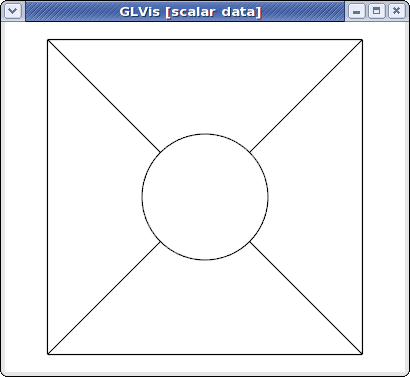

To explain MFEM's NURBS mesh file format, we first note that the topological part of the mesh (the `elements` and `boundary` sections) describe the 4 NURBS patches visible above. We use the vertex numbers as labels, so we only need the number of vertices.

In the NURBS case we need to also provide description of the edges on the patch boundaries and associate a knot vector with each of them. This is done in the `edges` section where the first index in each row refers to the knot vector id (from the following `knotvectors` section), while the remaining two indexes are the edge vertex numbers.

The position of the NURBS nodes (control points) is given as a NURBS grid function at the end of the file, while the associated weights are listed in the preceding `weights` section.

Some examples of VTK meshes can be found in MFEM's [data directory](https://github.com/mfem/mfem/blob/master/data). Here is one of the 3D NURBS meshes

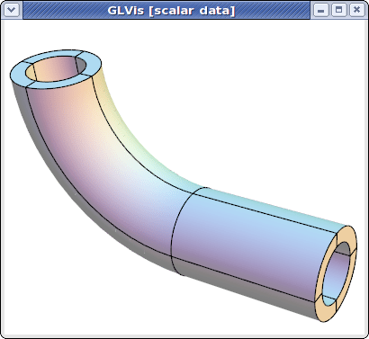

The image above was produced with some refinement (key "`o`") and mouse manipulations from
```sh
glvis -m pipe-nurbs.mesh
```

Solutions from NURBS discretization spaces are also natively supported. For example here is the approximation for the solution of a simple Poisson problem on a refined version of the above mesh.
```sh
glvis -m square-disc-nurbs.mesh -g sol.gf
```

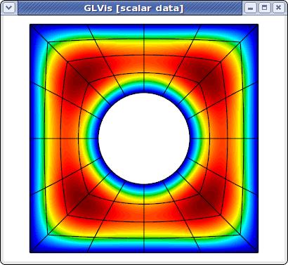


## Curvilinear VTK meshes

MFEM also supports quadratic triangular, quadrilaterals, tetrahedral and hexahedral curvilinear meshes in VTK format. This format is described in the [VTK file format documentation](http://vtk.org/VTK/img/file-formats.pdf). The local numbering of degrees of freedom for the biquadratic quads and triquadratic hexes can be found in the Doxygen reference of the [vtkBiQuadraticQuad](http://www.vtk.org/doc/release/5.6/html/a00185.html) and [vtkTriQuadraticHexahedron](http://www.vtk.org/doc/release/5.6/html/a02039.html) classes. Currently VTK does not support cubic, and higher-order meshes.

As an example, consider a simple curved quadrilateral saved in a file `quad.vtk`:
```sh
# vtk DataFile Version 3.0
Generated by MFEM
ASCII
DATASET UNSTRUCTURED_GRID
POINTS 9 double
0 0 0
1 0 0
1 1 0
0.1 0.9 0
0.5 -0.05 0
0.9 0.5 0
0.5 1 0
0 0.5 0
0.45 0.55 0
CELLS 1 10
9 0 1 2 3 4 5 6 7 8
CELL_TYPES 1
28
CELL_DATA 1
SCALARS material int
LOOKUP_TABLE default
1
```
Visualizing it with "`glvis -m quad.vtk`" and typing "`Aemiii`" in the GLVis window we get:

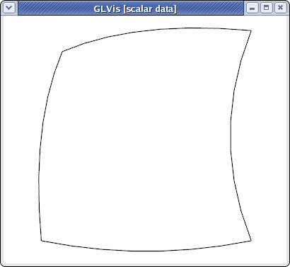

The "`i`" key increases the reference element subdivision which gives an increasingly better approximation of the actual curvature of the element. To view the curvature of the mapping inside the element we can use the "I" key, e.g.,
```sh
glvis -m quad.vtk -k "AemIIiii"
```
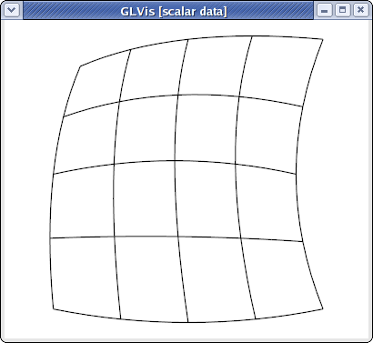

Here is a slightly more complicated [quadratic quadrilateral](https://github.com/mfem/mfem/blob/master/data/star-q2.vtk) mesh example (the different colors in the GLVis window are used to distinguish neighboring elements):
```sh
glvis -m star-q2.vtk -k "Am"
```
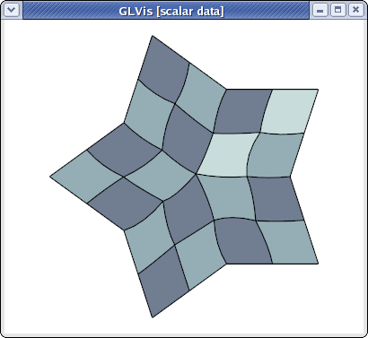

MFEM and GLVis can also handle [quadratic triangular](https://github.com/mfem/mfem/blob/master/data/square-disc-p2.vtk) meshes:
```sh
glvis -m square-disc-p2.vtk -k "Am"
```
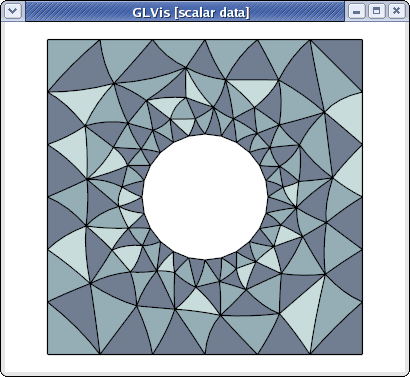

As well as [quadratic tetrahedral](https://github.com/mfem/mfem/blob/master/data/escher-p2.vtk) and [quadratic hexahedral](https://github.com/mfem/mfem/blob/master/data/fichera-q2.vtk) VTK meshes:
```sh
glvis -m escher-p2.vtk -k "Aaaooooo**************"
```
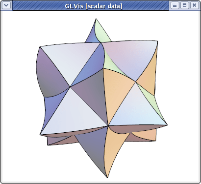
```sh
glvis -m fichera-q2.vtk -k "Aaaooooo******"
```
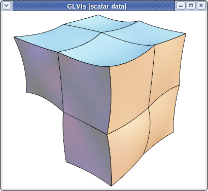
