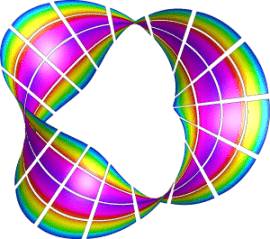
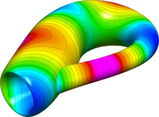
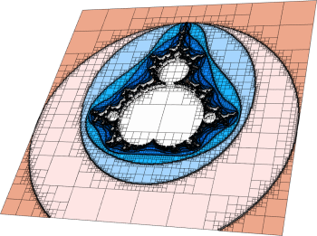
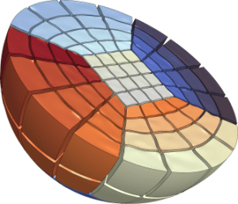

# Meshing

This page provides a brief description of MFEM's mesh formats, meshing mini applications, and related tools.

## Mesh formats

MFEM supports a number of mesh formats, including:

  - MFEM's [mesh v1.0 format](mesh-formats.md#mfem-mesh-v10) for [straight](mesh-formats.md#straight-meshes) meshes,
  - MFEM's [mesh v1.0 format](mesh-formats.md#curvilinear-and-more-general-meshes) for [arbitrary high-order curvilinear](mesh-format-v1.x.md) and more general meshes,
  - MFEM's [mesh v1.1 format](mesh-formats.md#mfem-mesh-v11), which adds support for non-conforming (AMR) meshes,
  - MFEM's mesh v1.2 format, which adds support for parallel meshes,
  - MFEM's format for [NURBS](mesh-formats.md#nurbs-meshes) meshes,
  - The [VTK](mesh-formats.md#curvilinear-vtk-meshes) unstructured mesh format, for triangular, quadrilateral, tetrahedral and hexahedral meshes,
  - The [Gmsh](http://gmsh.info/) ASCII and binary formats for 2D and 3D meshes.
  - The [CUBIT](https://cubit.sandia.gov/) meshes through the Genesis (NetCDF) binary format.
  - The [NETGEN](http://sourceforge.net/projects/netgen-mesher/) triangular and tetrahedral mesh formats,
  - The [TrueGrid](http://www.truegrid.com/) hexahedral mesh format.

Detailed description of these formats can be found on the [mesh formats](mesh-formats.md) page. These formats are also supported by MFEM's native visualization tool, [GLVis](http://glvis.org/).

## Meshing miniapps

The `miniapps/meshing` directory contains a collection of meshing-related miniapps based on MFEM.

Compared to the [example codes](examples.md), the miniapps are more complex,
demonstrating more advanced usage of the library. They are intended to be more
representative of MFEM-based application codes. We recommend that new users
start with the example codes before moving to the miniapps.

The current meshing miniapps are described below. Related tools are listed at the [bottom](#tools) of the page.

### Mobius Strip

This miniapp generates various Mobius strip-like surface meshes. It is a good
way to generate complex surface meshes.

Manipulating the mesh topology and
performing mesh transformation are demonstrated. The `mobius-strip` mesh in the
`data` directory was generated with this miniapp.

### Klein Bottle

This miniapp generates three types of Klein bottle surfaces. It is similar to
the mobius-strip miniapp.

The `klein-bottle` and `klein-donut` meshes in the
`data` directory were generated with this miniapp.

### Toroid

This miniapp generates two types of toroidal volume meshes; one with
triangular cross sections and one with square cross sections.

A wide variety of toroidal meshes can be generated by varying the
amount of twist as well as the major and minor radii and other
variables.  The `toroid-wedge` and `toroid-hex` meshes in the `data` directory
were generated with this miniapp.

### Extruder

This miniapp creates higher dimensional meshes from lower dimensional meshes
by extrusion.

Simple coordinate transformations can also be applied if desired.  The initial
mesh can be 1D or 2D. 1D meshes can be extruded in the y-direction first and
then in the z-direction.  2D meshes can be triangular, quadrilateral, or
contain both element types.

### Shaper

This miniapp performs multiple levels of adaptive mesh refinement to resolve the
interfaces between different "materials" in the mesh, as specified by a given
material() function.

It can be used as a simple initial mesh generator, for example in the case when
the interface is too complex to describe without local refinement. Both
conforming and non-conforming refinements are supported.

### Mesh Explorer

This miniapp is a handy tool to examine, visualize and manipulate a given
mesh.

Some of its features are:

- visualizing of mesh materials and individual mesh elements
- mesh scaling, randomization, and general transformation
- manipulation of the mesh curvature
- the ability to simulate parallel partitioning
- quantitative and visual reports of mesh quality

### Mesh Optimizer

This miniapp performs mesh optimization using the Target-Matrix Optimization
Paradigm (TMOP) by P.Knupp et al., and a global variational minimization
approach.

It minimizes the quantity $\sum_T \int_T \mu(J(x))$, where $T$ are the target
(ideal) elements, $J$ is the Jacobian of the transformation from the target
to the physical element, and $\mu$ is the mesh quality metric.

This metric can measure shape, size or alignment of the region around each
quadrature point. The combination of targets and quality metrics is used to
optimize the physical node positions, i.e., they must be as close as possible to
the shape / size / alignment of their targets.

