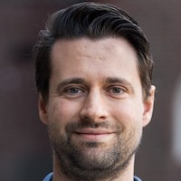
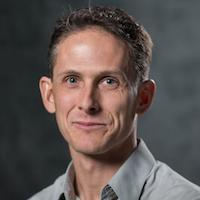
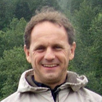
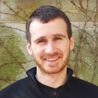
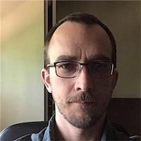

# FEM@LLNL Seminar Series

We are happy to announce a new FEM@LLNL seminar series, starting in 2022, which will focus on finite element research and applications talks of interest to the MFEM community. We have lined up some excellent speakers for our first year and plan to keep adding more. Videos will be added to a [YouTube playlist](https://www.youtube.com/playlist?list=PLy9rIbGDXrG1Lfy3Um-KEPqFae7Ipghqj) as well as this site's [videos page](videos.md).

### <i class="fa fa-envelope-o" aria-hidden="true"></i> Sign-Up

Fill in [this form](https://docs.google.com/forms/d/e/1FAIpQLScrJ9QT7v7abx2ELcETKJnhWaU7_Wa2V3d7WIPdf3_JYK4JmA/viewform?usp=sf_link) to sign-up for future FEM@LLNL seminar announcements.

### <i class="fa fa-star"></i> Next Talk

#### Ricardo Vinuesa (KTH)
##### *Modeling and controlling turbulent flows through deep learning*
##### [**9am PDT, TBD, 2022**](https://everytimezone.com/)
[<button type="button" class="btn btn-success">
**WebEx**
</button>]()

**Abstract:** The advent of new powerful deep neural networks (DNNs) has fostered their application in a wide range of research areas, including more recently in fluid mechanics. In this presentation, we will cover some of the fundamentals of deep learning applied to computational fluid dynamics (CFD). Furthermore, we explore the capabilities of DNNs to perform various predictions in turbulent flows: we will use convolutional neural networks (CNNs) for non-intrusive sensing, i.e. to predict the flow in a turbulent open channel based on quantities measured at the wall. We show that it is possible to obtain very good flow predictions, outperforming traditional linear models, and we showcase the potential of transfer learning between friction Reynolds numbers of 180 and 550. We also discuss other modelling methods based on autoencoders (AEs) and generative adversarial networks (GANs), and we present results of deep-reinforcement-learning-based flow control.

---

### <i class="fa fa-check" aria-hidden="true"></i> Previous Talks

#### Jeffrey Banks (RPI)
##### *Efficient Techniques for Fluid Structure Interaction: Compatibility Coupling and Galerkin Differences*
##### July 26, 2022
[<button type="button" class="btn btn-primary">
**Slides**
</button>](pdf/seminar/banks.pdf)
&nbsp;&nbsp;
[<button type="button" class="btn btn-success">
**Talk Recording**
</button>]()

**Abstract:** Predictive simulation increasingly involves the dynamics of complex systems with multiple interacting physical processes. In designing simulation tools for these problems, both the formulation of individual constituent solvers, as well as coupling of such solvers into a cohesive simulation tool must be addressed. In this talk, I discuss both of these aspects in the context of fluid-structure interaction, where we have recently developed a new class of stable and accurate partitioned solvers that overcome added-mass instability through the use of so-called compatibility boundary conditions. Here I will present partitioned coupling strategies for incompressible FSI. One interesting aspect of CBC-based coupling is the occurrence of nonstandard and/or high-derivative operators, which can make adoption of the techniques challenging, e.g. in the context of FEM methods. To address this, I will also discuss our newly developed Galerkin Difference approximations, which may provide a natural pathway for CBCs in an FEM context. Although GD is fundamentally a finite element approximation based on a Galerkin projection, the underlying GD space is nonstandard and is derived using profitable ideas from the finite difference literature. The resulting schemes possess remarkable properties including nodal superconvergence and the ability to use large CFL-one time steps. I will also present preliminary results for GD discretizations on unstructured grids using MFEM.

#### Paul Fischer (UIUC/ANL)
##### *Outlook for Exascale Fluid Dynamics Simulations*
##### June 21, 2022
[<button type="button" class="btn btn-primary">
**Slides**
</button>](pdf/seminar/fischer.pdf)
&nbsp;&nbsp;
[<button type="button" class="btn btn-success">
**Talk Recording**
</button>](https://www.youtube.com/watch?v=WqrwDarTdss&list=PLy9rIbGDXrG1Lfy3Um-KEPqFae7Ipghqj&index=8)

**Abstract:** We consider design, development, and use of simulation software for exascale computing, with a particular emphasis on fluid dynamics simulation. Our perspective is through the lens of the high-order code Nek5000/RS, which has been developed under DOE's Center for Efficient Exascale Discretizations (CEED).  Nek5000/RS is an open source thermal fluids simulation code with a long development history on leadership computing platforms--it was the first commercial software on distributed memory platforms and a Gordon Bell Prize winner on Intel's ASCII Red.  There are a myriad of objectives that drive software design choices in HPC, such as scalability, low-memory, portability, and maintainability.  Throughout, our design objective has been to address the needs of the user, including facilitating data analysis and ensuring flexibility with respect to platform and number of processors that can be used.

When running on large-scale HPC platforms, three of the most common user
questions are

+ How long will my job take?

+ How many nodes will be required?

+ Is there anything I can do to make my job run faster?

Additionally, one might have concerns about storage, post-processing (Will I be able to analyze the results?  Where?), and queue times.  This talk will seek to answer several of these questions over a broad range of fluid-thermal problems from the perspective of a Nek5000/RS user.  We specifically address performance with data for NekRS on several of the DOE's pre-exascale architectures, which feature AMD MI250X or NVIDIA V100 or A100 GPUs.

#### Mike Puso (LLNL)
##### *Topics in Immersed Boundary and Contact Methods: Current LLNL Projects and Research*
##### May 24, 2022
[<button type="button" class="btn btn-primary">
**Slides**
</button>](pdf/seminar/puso.pdf)
&nbsp;&nbsp;
[<button type="button" class="btn btn-success">
**Talk Recording**
</button>](https://www.youtube.com/watch?v=RasTXV6IYC0&list=PLy9rIbGDXrG1Lfy3Um-KEPqFae7Ipghqj&index=7)

**Abstract:** Many of the most interesting phenomena in solid mechanics occurs at material interfaces. This can be in the form of fluid structure interaction, cracks, material discontinuities, impact etc. Solutions to these problems often require some form of immersed/embedded boundary method or contact or combination of both. This talk will provide a brief overview of different lab efforts in these areas and presents some of the current research aspects and results using from LLNL production codes. Technically speaking, the methods discussed here all require Lagrange multipliers to satisfy the constraints on the interface of overlapping or dissimilar meshes which complicates the solution. Stability and consistency of Lagrange multiplier approaches can be hard to achieve both in space and time. For example, the wrong choice of multiplier space will either be over-constrained and/or cause oscillations at the material interfaces for simple statics problems. For dynamics, many of the basic time integration schemes such as Newmark's method are known to be unstable due to gaps opening and closing. Here we introduce some (non-Nitsche) stabilized multiplier spaces for immersed boundary and contact problems and a structure preserving time integration scheme for long time dynamic contact problems. Finally, I will describe some on-going efforts extending this work.

#### Robert Chiodi (UIUC)
##### *CHyPS: An MFEM-Based Material Response Solver for Hypersonic Thermal Protection Systems*
##### April 26, 2022
[<button type="button" class="btn btn-primary">
**Slides**
</button>](pdf/seminar/chiodi.pdf)
&nbsp;&nbsp;
[<button type="button" class="btn btn-success">
**Talk Recording**
</button>](https://www.youtube.com/watch?v=Z7jJZ1Z5gz0&list=PLy9rIbGDXrG1Lfy3Um-KEPqFae7Ipghqj&index=6)

**Abstract:** The University of Illinois at Urbana-Champaign’s Center for Hypersonics and Entry Systems Studies has developed a material response solver, named CHyPS, to predict the behavior of thermal protection systems for hypersonic flight.  CHyPS uses MFEM to provide the underlying discontinuous Galerkin spatial discretization and linear solvers used to solve the equations. In this talk, we will briefly present the physics and corresponding equations governing material response in hypersonic environments. We will also include a discussion on the implementation of a direct Arbitrary Lagrangian-Eulerian approach to handle mesh movement resulting from the ablation of the material surface. Results for standard community test cases developed at a series of Ablation Workshop meetings over the past decade will be presented and compared to other material response solvers. We will also show the potential of high-order solutions for simulating thermal protection system material response.

#### Tamas Horvath (Oakland University)
##### *Space-Time Hybridizable Discontinuous Galerkin with MFEM*
##### March 29, 2022
[<button type="button" class="btn btn-primary">
**Slides**
</button>](pdf/seminar/horvath.pdf)
&nbsp;&nbsp;
[<button type="button" class="btn btn-success">
**Talk Recording**
</button>](https://www.youtube.com/watch?v=v8-EubYMT-A&list=PLy9rIbGDXrG1Lfy3Um-KEPqFae7Ipghqj&index=5)

**Abstract:** Unsteady partial differential equations on deforming domains appear in many real-life scenarios, such as wind turbines, helicopter rotors, car wheels, free-surface flows, etc. We will focus on the space-time finite element method, which is an excellent approach to discretize problems on evolving domains. This method uses discontinuous Galerkin to discretize both in the spatial and temporal directions, allowing for an arbitrarily high-order approximation in space and time. Furthermore, this method automatically satisfies the geometric conservation law, which is essential for accurate solutions on time-dependent domains. The biggest criticism is that the application of space-time discretization increases the computational complexity significantly. To overcome this, we can use the high-order accurate Hybridizable or Embedded discontinuous Galerkin method. Numerical results will be presented to illustrate the applicability of the method for fluid flow around rigid bodies.

#### Tobin Isaac (Georgia Tech)
##### *Unifying the Analysis of Geometric Decomposition in FEEC*
##### March 22, 2022
[<button type="button" class="btn btn-primary">
**Slides**
</button>](https://tinyurl.com/isaac-feec-mfem)
&nbsp;&nbsp;
[<button type="button" class="btn btn-success">
**Talk Recording**
</button>](https://www.youtube.com/watch?v=edK62yPUtIs&list=PLy9rIbGDXrG1Lfy3Um-KEPqFae7Ipghqj&index=4)

**Abstract:** Two operations take function spaces and make them suitable for finite element computations. The first is the construction of trace-free subspaces (which creates "bubble" functions) and the second is the extension of functions from cell boundaries into cell interiors (which create edge functions with the correct continuity): together these operations define the _geometric decomposition_ of a function space. In finite element exterior calculus (FEEC), these two operations have been treated separately for the two main families of finite elements: full polynomial elements and trimmed polynomial elements. In this talk we will see how one constructor of trace-free functions and one extension operator can be used for both families, and indeed for all differential forms. We will also examine the practicality of these two operators as tools for implementing geometric decompositions in actual finite element codes.

#### Raphaël Zanella (UT Austin)
##### *Axisymmetric MFEM-Based Solvers for the Compressible Navier-Stokes Equations and Other Problems*
##### March 1, 2022
[<button type="button" class="btn btn-primary">
**Slides**
</button>](pdf/seminar/zanella.pdf)
&nbsp;&nbsp;
[<button type="button" class="btn btn-success">
**Talk Recording**
</button>](https://www.youtube.com/watch?v=qCW60wWmv4Y&list=PLy9rIbGDXrG1Lfy3Um-KEPqFae7Ipghqj&index=3)

**Abstract:** An axisymmetric model leads, when suitable, to a substantial cut in the computational cost with respect to a 3D model. Although not as accurate, the axisymmetric model allows to quickly obtain a result which can be satisfying. Simple modifications to a 2D finite element solver allow to obtain an axisymmetric solver. We present MFEM-based parallel axisymmetric solvers for different problems. We first present simple axisymmetric solvers for the Laplacian problem and the heat equation. We then present an axisymmetric solver for the compressible Navier-Stokes equations. All solvers are based on H^1-conforming finite element spaces. The correctness of the implementation is verified with convergence tests on manufactured solutions. The Navier-Stokes solver is used to simulate axisymmetric flows with an analytical solution (Poiseuille and Taylor-Couette) and an air flow in a plasma torch geometry.

#### Robert Carson (LLNL)
##### *An Overview of ExaConstit and Its Use in the ExaAM Project*
##### February 1, 2022
[<button type="button" class="btn btn-primary">
**Slides**
</button>](pdf/seminar/carson.pdf)
&nbsp;&nbsp;
[<button type="button" class="btn btn-success">
**Talk Recording**
</button>](https://www.youtube.com/watch?v=I0kTJdR8oZU&list=PLy9rIbGDXrG1Lfy3Um-KEPqFae7Ipghqj&index=2)

**Abstract:** As additively manufactured (AM) parts become increasingly more popular in industry, a growing need exists to help expediate the certifying process of parts. The ExaAM project seeks to help this process by producing a workflow to model the AM process from the melt pool process all the way up to the part scale response by leveraging multiple physics codes run on upcoming exascale computing platforms. As part of this workflow, ExaConstit is a next-generation quasi-static, solid mechanics FEM code built upon MFEM used to connect local microstructures and local properties within the part scale response. Within this talk, we will first provide an overview of ExaConstit, how we have ported it over to the GPU, and some performance numbers on a number of different platforms. Next, we will discuss how we have leveraged MFEM and the FLUX workflow to run hundreds of high-fidelity simulations on Summit in-order to generate the local properties needed to drive the part scale simulation in the ExaAM workflow. Finally, we will show case a few other areas ExaConstit has been used in.

####  Guglielmo Scovazzi (Duke University)
##### *The Shifted Boundary Method: An Immersed Approach for Computational Mechanics*
##### January 20, 2022
[<button type="button" class="btn btn-primary">
**Slides**
</button>](pdf/seminar/scovazzi.pdf)
&nbsp;&nbsp;
[<button type="button" class="btn btn-success">
**Talk Recording**
</button>](https://www.youtube.com/watch?v=WJ5dAhOR6Gg&list=PLy9rIbGDXrG1Lfy3Um-KEPqFae7Ipghqj&index=1)

**Abstract:** Immersed/embedded/unfitted boundary methods obviate the need for continual re-meshing in many applications involving rapid prototyping and design. Unfortunately, many finite element embedded boundary methods are also difficult to implement due to the need to perform complex cell cutting operations at boundaries, and the consequences that these operations may have on the overall conditioning of the ensuing algebraic problems. We present a new, stable, and simple embedded boundary method, named “shifted boundary method” (SBM), which eliminates the need to perform cell cutting. Boundary conditions are imposed on a surrogate discrete boundary, lying on the interior of the true boundary interface. We then construct appropriate field extension operators, by way of Taylor expansions, with the purpose of preserving accuracy when imposing the boundary conditions. We demonstrate the SBM on large-scale solid and fracture mechanics problems; thermomechanics problems; porous media flow problems; incompressible flow problems governed by the Navier-Stokes equations (also including free surfaces); and problems governed by hyperbolic conservation laws.

---

### <i class="fa fa-calendar" aria-hidden="true"></i> Future Talks

&nbsp;

#### Dennis Ogiermann (University of Bochum)
##### *Computing meets Cardiology: Making heart simulations fast and accurate*
##### **September 13, 2022**

---

#### Clark Dohrmann (SNL)
##### *High-Order Finite Elements and Applications to Elastic Wave Propagation*
##### **October 11, 2022**

---

#### Garth Wells (University of Cambridge)
##### *FEniCSx: design of the next generation FEniCS libraries for finite element methods*
##### **November 8, 2022**

---

#### Lin Mu (University of Georgia)
##### *An Efficient and Effective FEM Solver for Diffusion Equation with Strong Anisotropy*
##### **December 13, 2022**

---

&nbsp;

