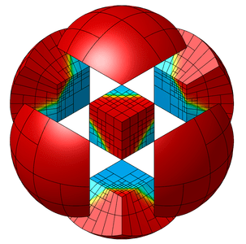

# MFEM AWS Tutorial
#### August 15, 2022

Welcome to the MFEM tutorial, part of the
[RADIUSS Tutorial Series](https://software.llnl.gov/radiuss/event/2022/07/07/radiuss-on-aws/)
in collaboration with AWS!

The pages below provide a self-paced overview of MFEM, and its use for scalable
finite element discretizations and application development. You can follow
along on your own EC2 instance. No previous experience is necessary.

We recommend that you start with Lessons 1 and 2, and then pick one or several
from Lessons 3, 4, 5 and 6, depending on your interest.

### Lesson 1. [Getting Started](start.md)

This is the first page you should visit to setup your tutorial environment.
You will learn about:

- Setting up Visual Studio Code editor and terminal
- Setting up GLVis for visualization
- Testing the setup with a simple MFEM example

### Lesson 2. [Finite Element Basics](fem.md)

Once you have the tutorial environment working, visit this page to learn about
the basics of the finite element method and its implementation in MFEM. The
lesson covers:

- Annotated Example 1
- Serial and parallel runs
- GLVis keys/web interface

### Lesson 3. [Tour of MFEM Examples](examples.md)

This is an optional lesson where you can learn about MFEM's main features: support
for high-order methods, adaptive mesh refinement, $H^1$, $H(curl)$, $H(div)$ and $L^2$
discretizations, through several of the examples included with the library:

- High-order methods for the full de Rham complex (Examples 1, 2, 3, 4)
- Discontinuous Galerkin (Example 9)
- Nonlinear elasticity (Example 10)
- Adaptive mesh refinement (Example 15)
- Complex methods, PML (Examples 22, 25)

### Lesson 4. [Meshing and Visualization](meshvis.md)

This is an optional lesson that illustrates MFEM's support for external mesh generators,
internal meshing tools and optimization, and external visualization tools.
You will learn about:

- Importing meshes from Gmsh and Cubit
- MFEM's meshing tools: Mesh Explorer, Mesh Optimizer and Shaper
- Visualizing results in VisIt and Paraview

### Lesson 5. [Solvers and Scalability](solvers.md)

This is an optional lesson that showcases MFEM's parallel scalability and support for efficient
solvers and preconditioners.  The lesson covers:

- Scalable algebraic multigrid preconditioners from hypre (Examples 1, 2, 3, 4)
- MFEM's native Multigrid solver (Example 26)
- Low-order refined methods (Solvers and Transfer miniapps)
- Additional solver integrations via PETSc, SuperLU and STRUMPACK

### Lesson 6. [Further Steps](further.md)

This is an optional lesson with further activities, including:

- Write your own simple simulation starting from one of the MFEM examples
- Visit the MFEM website to review the Features, Examples, Publications, Finite Elements pages
- Watch MFEM-related videos and seminar talks
- Join the MFEM organization on GitHub to contribute to the project

